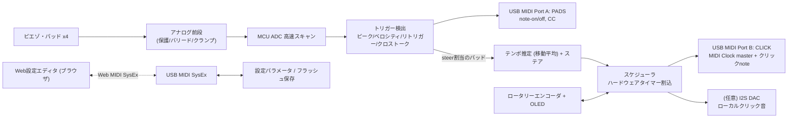

# STEER METRO Device — 設計仕様書 v0.1

**目的**: 複数のドラムパッド（ピエゾ・トリガー）を入力とし、
(1) パッドの打撃を **USB MIDI ノート** として送出、
(2) 「叩いて先導 → 放すと本来テンポへ自然復帰」する **ステア付きメトロノーム** を内蔵し、その **クリックを MIDI（ノート＋MIDIクロック・マスター）** として送出、
(3) 設定は **GUI（Web MIDI SysEx エディタ）** で行える、
—— を1台で完結させる自作デバイス。

音源（サンプル再生）は持たない。発音は外部（DAW/サンプラー/このプロジェクトの Web アプリ）に任せる方針。ローカルの簡易クリック音は任意オプションとして搭載可能。

---

## 1. 設計目標と非目標

**目標**
- パッド入力：4 系統（将来拡張可）。シングルゾーン標準、デュアルゾーン対応可。
- 低レイテンシ：打撃→USB MIDI 出力まで概ね 5 ms 以下。
- 正確なクリック：ハードウェアタイマーで刻み、ジッターの少ないクリック＆MIDIクロック。
- ステア＆復帰ロジックをデバイス内で完結（Web アプリのアルゴリズムを移植）。
- MIDIクロック・マスターとして動作 → DAW・他機材・Webアプリを丸ごと同期できる。
- 設定は GUI（ノート割当・感度・カーブ・クロストーク・テンポ・拍子・アクセント・復帰率…）。

**非目標（v1では見送り）**
- 内蔵サンプル音源、ポジショナルセンシング、3ゾーン、無線MIDIは将来拡張。

---

## 2. システム構成



要点：**パッド系（Port A）** と **クリック/クロック系（Port B）** を別 MIDI ポートに分けると、ホスト側でルーティングが綺麗になる（1ポート構成も選択可）。

---

## 3. ハードウェア

### 3.1 MCU 選定

| 案 | 長所 | 短所 | 位置づけ |
|---|---|---|---|
| **Teensy 4.1**（推奨） | 600MHz、ADC入力が多くて速い、Teensyduinoでネイティブ USB MIDI が容易、I2Sオーディオ簡単、RAM/Flash潤沢 | 専用ボード（とはいえ安価・入手容易） | **本命**。トリガー処理・USB MIDI・音声出力まで一番ラク |
| **RP2350 (Pico 2)** ＋外部ADC | 安価、"Raspberry Pi"、PIO/2コア、TinyUSBでUSB MIDI | 内蔵ADCが実質3ch・低速なので **外部SPI ADC（MCP3208等）必須** | 低コスト/オープン志向の代替 |
| STM32F4/F7 | 高速ADC＋DMAが強力 | 開発の敷居が高い | 上級者向け |

**推奨は Teensy 4.1**。理由は、ドラムトリガー自作で最重要な「多チャンネルの高速アナログ読み取り」と「確実なクラスコンプライアント USB MIDI」を、追加ICなしで両立できるから。以降は Teensy 4.1 を主対象に記述し、Pico 版の差分は §3.6 に。

### 3.2 アナログ前段（1入力あたり／**必須**）

ピエゾは打撃時に数十Vのスパイクを出す。**直結厳禁**。定番の保護＋整形回路：

```
   Pad(TIP) ──┬───[ R_series 1kΩ ]───┬──► ADC pin (例: A0)
              │                      │
            [R_bleed 1MΩ]         (クランプ)
              │              D1 ▲ to 3.3V   D2 ▼ to GND
   Pad(GND) ──┴──────────────── GND ────────┘
```

- **R_bleed 1MΩ**（並列）：電荷を逃がし、余韻/減衰を作る。
- **R_series 1kΩ**（直列）：クランプへの電流制限。
- **D1/D2 クランプ・ダイオード**（1N4148 か Schottky の BAT85 等）：ADCピンを 0〜3.3V にクランプして保護。
- 追加のオペアンプ・バッファは通常不要（弱いピエゾのみ増幅を検討）。
- **サンプリングはファーム側でピーク検出**（外付けピークホールドは不要／Teensyのadcが十分速い）。

**デュアルゾーン**（TRS の Ring を使用）:
- *piezo/switch*（Roland系リム/エッジ）: Ring はスイッチで固定電圧を作る → デジタル/しきい値で判定。
- *piezo/piezo*（Yamaha 3ゾーン等）: Ring も別ピエゾ → もう1chの前段が必要。
- ⚠ Yamaha と Roland でリム/ゾーンの配線仕様が違うため、ゾーン判定はパッド機種ごとにGUIで切替できるようにする。**まずはシングルゾーンで確実に**、デュアルは入力を2ch消費するオプションとして実装。

### 3.3 入出力一覧

| I/O | 数 | 備考 |
|---|---|---|
| トリガー入力（1/4" TRS） | 4 | シングル標準、任意でデュアル（2ch消費） |
| ペダル/エクスプレッション入力（1/4" TRS） | 1 | ハイハット/エクスプレッション → CC or テンポ・ナッジ |
| USB-C（デバイス） | 1 | ホストへ。バスパワー |
| MIDI DIN OUT / IN（任意） | 各1 | レガシー機材同期用。OUTはバッファ、INは6N138等で絶縁 |
| オーディオOUT（任意, 3.5/6.35mm） | 1 | I2S DAC（PCM5102）＋小型アンプ。ローカルクリック |
| ボリューム・ポット（任意） | 1 | クリック音量（アナログ入力1ch） |
| OLED（I2C, SSD1306） + ロータリーエンコーダ（任意） | 1 | 単体運用時のBPM/開始停止 |

### 3.4 概算 BOM（Teensy版・4入力・オーディオ/表示込み）

| 品目 | 数 | 概算 |
|---|---|---|
| Teensy 4.1 | 1 | ¥4,500 |
| 1/4" TRS ジャック | 5 | ¥1,000 |
| 抵抗（1MΩ/1kΩ）・ダイオード（1N4148/BAT85） | 一式 | ¥500 |
| PCM5102 I2S DAC モジュール | 1 | ¥600 |
| 小型ヘッドホンアンプ（PAM8908等）＋ジャック | 1 | ¥500 |
| SSD1306 OLED ＋ ロータリーエンコーダ | 1 | ¥900 |
| ボリューム・ポット | 1 | ¥150 |
| （任意）MIDI DIN ＋ 6N138 | 一式 | ¥600 |
| ユニバーサル基板/配線/筐体 | 一式 | ¥2,000〜 |
| **合計** |  | **概ね ¥10,000〜14,000** |

Pico 版なら本体が安い代わりに MCP3208（¥400前後）×1 を追加。4入力なら内蔵ADC＋マルチプレクサ(74HC4051)でも可。

### 3.5 参考ピンマッピング（Teensy 4.1・要調整）

| 機能 | ピン | 備考 |
|---|---|---|
| Pad 1–4（アナログ） | A0–A3 | ADC。デュアル時は追加のAxを消費 |
| ペダル/エクスプレッション | A4 | 連続値 |
| クリック音量ポット | A5 | 連続値 |
| I2S DAC（クリック音） | 7(TX), 20(LRCLK), 21(BCLK), 23(MCLK) | Teensy Audio ライブラリ既定 |
| OLED（I2C） | 18(SDA), 19(SCL) | SSD1306 |
| ロータリーエンコーダ | 2, 3, 4(SW) | 割込対応ピン推奨 |
| MIDI DIN（任意, UART） | 1(TX1), 0(RX1) | Serial1 |
| USB（デバイス） | 内蔵 microUSB | ネイティブ USB MIDI |

> ピン番号は目安。ADC割当は実配線とノイズを見て調整。

### 3.6 Pico 2（RP2350）版の差分
- 内蔵ADCは実質3chなので、**外部ADC MCP3208（8ch/12bit/SPI）** で全パッドを読む。
- USB MIDI は TinyUSB（Arduino-Pico）でクラスコンプライアント。
- PIO と2コアを活かし、コア0＝スキャン/検出、コア1＝スケジューラ/USB という分業が可能。
- 音声出力は PT8211/PCM5102（I2S）または PWM+RC。

---

## 4. ファームウェア設計

### 4.1 モジュール構成
- **ADC Scanner**：全chラウンドロビンで高速サンプリング（可能なら DMA + 連続変換）。
- **Trigger Detector**：ch毎のステートマシン（しきい値検出→スキャン窓でピーク→リトリガー・マスク）。
- **Crosstalk Filter**：他chの直近発火と相対レベルで誤爆抑制。
- **Velocity Mapper**：ピーク→ベロシティ（カーブ適用）。
- **MIDI Out (Pads)**：note-on/off・CC を Port A へ。
- **Tempo Engine**：ステア対象パッドの打点からテンポ推定＋復帰。
- **Scheduler / Clock Master**：タイマーで拍・細分・MIDIクロックを刻む。
- **Local Click**（任意）：I2S へクリック波形。
- **SysEx Config**：Get/Set パラメータ、フラッシュ保存。
- **UI**：エンコーダ/OLED（BPM・開始停止・簡易編集）。

### 4.2 トリガー検出（1ch のロジック）

```c
// 状態: IDLE, SCAN, MASK
switch (ch.state) {
  case IDLE:
    if (sample > ch.threshold) { ch.peak = sample; ch.t0 = micros(); ch.state = SCAN; }
    break;
  case SCAN:                                 // スキャン窓(例 1〜3ms)でピークを拾う
    if (sample > ch.peak) ch.peak = sample;
    if (micros() - ch.t0 >= ch.scanUs) {
      if (!crosstalk_suppressed(ch)) {       // §4.3 クロストーク判定
        uint8_t vel = velocityCurve(ch, ch.peak);
        midiPadNoteOn(ch.note, vel);         // Port A へ
        if (ch.steer) tempoTap(now_seconds()); // ステア対象なら §4.4 へ
      }
      ch.maskUntil = micros() + ch.maskUs;   // リトリガー・マスク(20〜40ms, velで可変)
      ch.state = MASK;
    }
    break;
  case MASK:
    if (micros() >= ch.maskUntil && sample < ch.threshold) ch.state = IDLE;
    break;
}
```

- **scanUs**（1〜3ms）：ピークを取り切る窓。長いほど正確だが遅延増。
- **maskUs**（20〜40ms、velで可変）：二度打ち防止。
- ステア用途ではベロシティ精度より **打点タイミング** が主。まずは threshold + peak + mask で十分実用。

### 4.3 クロストーク抑制
- あるchが発火した直後（例 5〜10ms窓）に別chが発火した場合、その別chのピークが「発火chのピーク × 係数」を下回るなら誤爆として無視。
- ペア毎のしきい値をGUIで調整（隣接パッド間で強め、離れていれば弱め）。
- 実装は「直近発火の時刻とレベル」を保持し、新規発火時に相対比較。

### 4.4 テンポエンジン（ステア＋復帰・Webアプリ移植）

打点間隔から推定（直近数拍の移動平均・一定時間で測り直し）→ 間隔（秒）空間で毎拍 recPct ずつ目標へ寄せ、終盤は下限で有限拍着地。

```c
// 打点ごと（ステア対象パッド）
void tempoTap(double now) {
  if (nTaps && now - taps[nTaps-1] > 2.0) nTaps = 0;   // 2秒空いたら測り直し
  taps[nTaps % 4] = now; nTaps++;
  int n = min(nTaps, 4);
  if (n >= 2) {
    double avg = (taps[(nTaps-1)%4] - taps[(nTaps-n)%4]) / (n-1);
    if (avg > 0.15 && avg < 2.5) curBPM = clamp(60.0/avg, BPM_MIN, BPM_MAX);
  }
  rephaseScheduler(now);   // 次拍を now 起点へ（欠け/二重を防ぐ、§4.5）
}

// 拍境界ごと（スケジューラから呼ぶ）: 間隔%復帰＋下限
void applyRecovery() {
  const double REC_FLOOR = 0.5;                 // BPM/拍 の最低詰め量
  double Itar = 60.0/targetBPM, I = 60.0/curBPM;
  I += (Itar - I) * recPct;                     // 比例(％)で寄せる
  double bpm = clamp(60.0/I, BPM_MIN, BPM_MAX);
  double gap = targetBPM - curBPM;
  if (fabs(gap) > 0.05) {
    double minStep = fmin(fabs(gap), REC_FLOOR);
    if (fabs(bpm - curBPM) < minStep) bpm = curBPM + copysign(minStep, gap);
  }
  curBPM = (fabs(bpm - targetBPM) < 0.05) ? targetBPM : bpm;
}
```

「直前に鳴った拍の吸収（フラム/二重カウント防止）」もWebアプリと同じ判定を移植する。

### 4.5 スケジューラ＆MIDIクロック・マスター

**方針**：マイクロ秒精度の“次イベント時刻”を持ち、ハードウェアタイマー（Teensy `IntervalTimer` 等）で刻む。**MIDIクロックは24 PPQN**。24ティック＝1拍として、拍境界で `applyRecovery()`・アクセント判定・クリック発音を行う。

```c
// tickInterval = (60.0/curBPM)/24  秒。毎ティックで:
void onClockTick() {
  usbMidiClock();                         // 0xF8 を Port B へ（マスター）
  if (++tick24 >= 24) {                    // 1拍
    tick24 = 0;
    applyRecovery();                       // テンポを目標へ寄せる
    int lvl = accents[beat];               // 0=無音 1=通常 2=● 3=◎
    if (lvl) { clickNoteOn(lvl); localClick(lvl); }  // Port B へ + 任意ローカル音
    beat = (beat+1) % beatsPerBar;
    subCount = 0;
  } else if (subdivision > 1 && (tick24 % (24/subdivision) == 0)) {
    clickNoteOn(0);                        // 細分クリック（弱）
  }
  nextTickUs += (uint32_t)((60.0/curBPM)/24.0 * 1e6);  // 次ティックはcurBPM反映
  timer.begin(onClockTick, nextTickUs - micros());     // or 固定周期タイマー内で判定
}
```

- **rephase（ステア時）**：打点 now を基準に「次拍＝now＋1拍」へ位相を合わせ、`tick24=0` に。連続スケジューリングなので、叩くのをやめても次拍は自動で鳴り、欠けない。
- **Start/Stop/Continue**：0xFA/0xFC/0xFB を Port B に送出（他機材の同期用）。
- **注意**：USB MIDI はフレーム由来で ~1ms のジッターがある。厳密同期が要る現場では **DIN MIDI OUT からもクロックを出す**とタイトになる（任意DIN実装の価値はここ）。

### 4.6 レイテンシ設計
- ADCスキャン＋検出：`scanUs`（1〜3ms）＋処理数十µs。
- USB MIDI送出：概ね ~1ms。
- **合計 ~2〜5ms**。ステア/演奏用途に十分。`scanUs` を詰めれば下がるが、ベロシティ精度とトレードオフ。

---

## 5. USB MIDI 実装

### 5.1 ポート構成（2ポート推奨）
- **Port A "PADS"**：各パッドの打撃（note-on/off）、ペダル/エクスプレッション（CC）。
- **Port B "CLICK"**：クリック（note）、**MIDIクロック（0xF8）**、Start/Stop/Continue、Song Position。BPM表示用に任意でCC/NRPN。
- 1ポート統合も設定で選択可。

### 5.2 MIDI インプリメンテーション・チャート（既定値・GUIで変更可）

| 対象 | メッセージ | 既定 |
|---|---|---|
| Pad 1..8 打撃 | Note On/Off ch10 | 例: 38,40,48,45,43,46,51,49（GM準拠は任意） |
| デュアルゾーン Rim | 別Note | パッド毎に割当 |
| ペダル/エクスプレッション | CC ch10 | CC4 (Foot) 例 |
| クリック（通常/●/◎/細分） | Note On ch16 | 例: 33/34/35/37（vel でも可） |
| テンポ同期 | Timing Clock 0xF8 | 24 PPQN |
| 走行制御 | Start/Stop/Continue 0xFA/FC/FB | — |
| 現在BPM（表示用） | NRPN or CC（任意） | — |
| 設定 | SysEx（§5.4） | Non-commercial ID 0x7D |

### 5.3 クロック／トランスポート
- デバイスが **クロック・マスター**。ステアで揺れたテンポも 0xF8 の間隔に反映される＝スレーブ側（DAW/このWebアプリ/ドラムマシン）が丸ごと追従。
- 逆に外部同期したい場合は将来「クロック・スレーブ」モードも追加可能（今回は非目標）。

### 5.4 SysEx コンフィグ仕様（草案）

```
F0 7D 00 <cmd> <payload...> F7
  cmd 0x01 GET_ALL            → デバイスが全パラメータをダンプ
  cmd 0x02 SET_PARAM  <id_hi id_lo> <val_hi val_lo>
  cmd 0x03 GET_PARAM  <id_hi id_lo>
  cmd 0x04 SAVE                → フラッシュへ永続化
  cmd 0x05 LOAD_DEFAULT
  cmd 0x10 MONITOR_ON/OFF     → 打撃メータをSysExで逐次送信（GUIの可視化用）
```
- 7bit境界を守るため 14bit 値は hi/lo 分割。
- パラメータIDは §6.1 の表に対応。フラッシュ保存は Teensy の EEPROM エミュ / LittleFS、Pico はフラッシュ末尾セクタ。

---

## 6. 設定 GUI（Web MIDI SysEx エディタ・推奨）

**方針**：インストール不要の **ブラウザ製エディタ**。Web MIDI（Chrome/Edge/Android/PC）で SysEx を送受信し、パラメータの読取・編集・書込・ライブ監視を行う。**このプロジェクトの STEER METRO Web アプリに「デバイス」タブとして統合**すれば、資産をそのまま活かせる。

- iOS 制約：Web MIDI 非対応のため **設定は Android/PC で**（デバイス本体の演奏は iOS でも USB MIDI で可）。どうしても iOS 設定が要るなら WebUSB か小さな Electron アプリを別途。

### 6.1 パラメータ一覧（GUIで編集）

| 区分 | パラメータ | 範囲/型 |
|---|---|---|
| グローバル | 目標BPM（ホーム） | 20–300 |
| グローバル | 拍子（beats / note value） | 1–12 / 2,4,8,16 |
| グローバル | 細分化 | 4分/8分/3連/16分 |
| グローバル | アクセント配列 | 拍毎 0–3（無音/通常/●/◎） |
| グローバル | 復帰率 recPct | 2–30 % /拍 |
| グローバル | 復帰下限 REC_FLOOR | 0.2–1.0 BPM/拍 |
| グローバル | ステア移動平均 区間数 / 測り直し秒 | 2–8 / 1–3s |
| クリック | 出力ノート（通常/●/◎/細分） | 0–127 |
| クリック | ローカル音 ON/OFF・音量 | — / 0–100 |
| ポート | MIDIクロック送出 ON/OFF・ポート構成 | — |
| パッド毎 | MIDIノート（Head/Rim） | 0–127 |
| パッド毎 | 役割 role | note専用 / steer / 両方 |
| パッド毎 | しきい値・ゲイン | — |
| パッド毎 | ベロシティ・カーブ | linear/exp/log/固定 |
| パッド毎 | scan窓・リトリガーマスク | 1–3ms / 20–60ms |
| パッド毎 | クロストーク（対ペア） | 係数・窓 |
| パッド毎 | ゾーン | single / dual(piezo-sw) / dual(piezo-piezo) |
| ペダル | CC番号 / テンポ・ナッジ割当 | — |

### 6.2 ライブモニタ
- `MONITOR_ON` で各パッドの直近ピーク/ベロシティをバー表示。しきい値・クロストークをリアルタイムで追い込む。
- 受信 note-on を可視化（どのパッドが鳴ったか）。

---

## 7. ローカル・クリック音（任意）
- Teensy Audio ＋ PCM5102（I2S）でヘッドホン/ライン出力。単体でドラマーのイヤモニ・クリックに使える（ホスト不要）。
- 波形は合成（矩形/木/クリック/カウベル）。アクセント段階で音程・音量可変（Webアプリと同じ設計）。
- 音量はポット（A9）で物理調整。

---

## 8. 筐体・操作（任意だが実戦で有用）
- OLED＋ロータリーエンコーダで、GUIなしでも「BPM変更・スタート/ストップ・目標へ即リセット」。
- ステージ運用を想定し、TRSジャック列は背面、USB-Cとオーディオ/音量は側面、エンコーダ/OLEDは天面。
- 電源：USBバスパワー基本。オーディオアンプ次第で消費電流を確認（不足なら外部給電）。

---

## 8.5 回路基板・筐体の作り方（実装ガイド）

### 8.5.1 大原則：いきなり基板/筐体を起こさない
順番は **試作 → 検証 → 基板 → 筐体**。まずユニバーサル基板（perfboard）で 1ch → 4ch の前段＋Teensy を組み、しきい値・クロストーク・レイテンシを詰める。**回路が確定してから** PCB と筐体を起こす。ここを飛ばすと作り直しになる。

### 8.5.2 回路基板（PCB）
- **設計ツール**：**KiCad（無料・定番）** 推奨。最短で発注まで行きたいなら **EasyEDA（ブラウザ）→ JLCPCB** が楽。Fritzing は入門向けだが本用途は KiCad が無難。
- **層数**：低速なので **2層で十分**。
- **Teensyは“載せる”のではなくソケット実装**：本機はTeensyモジュールを差す **キャリア基板（シールド）**にする。基板側にはピンソケットを付け、Teensyは抜き差し可能に（故障時交換・書込みが楽）。基板の主役は「TRSジャック＋保護部品＋各コネクタ（OLED/エンコーダ/DAC/ポット）」。
- **部品実装**：手はんだ前提なら **THT（スルーホール）中心**が安全。慣れていれば 0805 程度のSMDでも可。TRSジャックはTHTの頑丈なものを。
- **アナログ配線の勘所**：
  - **GNDべた（グラウンドプレーン）** を敷く。
  - トリガー信号の配線は**短く**、USB/I2S/クロック等の**ノイズ源から離す**。
  - 各入力の 1MΩ/1kΩ/ダイオードは**ジャック直近**に置く。
  - 電源に**デカップリングコンデンサ**（0.1µF＋数µF）を各ICへ。
- **ジャックの付け方（重要）**：
  - **基板直付け（board-mount）**＝配線が綺麗だが筐体寸法に厳しく縛られる。
  - **パネルマウント＋短線（panel-mount）**＝ドラムの**振動環境に強く**、筐体自由度が高い。**初回はパネルマウント推奨**。
- **USB端子を酷使しない**：Teensyの micro-USB を直接抜き差しに使うと折れる。**パネルにUSB-Cジャック**を出し、短ケーブル/USB-Cブレイクアウトで内部のTeensyへ。
- **テストポイント/シルク**：Pad1〜4・Pedal・GND・3.3V にラベルとテストポイントを。
- **製造**：JLCPCB / PCBWay。2層・小サイズなら **5枚で数百円＋送料**。SMD実装代行も可だが、THT主体なら手はんだで十分。

### 8.5.3 筐体
選択肢と向き不向き：

| 方式 | 長所 | 短所 | 向き |
|---|---|---|---|
| **既製プロジェクトボックス（Hammondアルミ 1590系 / ABS）** | 頑丈・安い・シールド（金属）・すぐ手に入る | 加工（穴あけ）が要る・自由度低め | **初回の本命**。ステージ運用に強い |
| **3Dプリント（Fusion360/FreeCAD/Tinkercad）** | 形状自由・窓や穴を最初から設計・反復が安い | 金属より弱くシールドなし・耐熱/振動に注意 | プリンタがある人・試作反復 |
| **レーザー加工アクリルのサンドイッチ（前後パネル＋スタンドオフ）** | 加工容易・見た目良い | 剛性はほどほど | 見せる用途 |

- **加工が必要な穴**：TRSジャック×5、USB-C、エンコーダ軸、OLED窓、オーディオOUT＋音量ポット。金属箱はステップドリル/シャーシパンチが楽。
- **ラベル**：3Dプリントなら**エンボス（浮き文字）**、金属/アクリルなら**印刷パネル/レーザー刻印**、簡易ならラベルシール。
- **機械的な勘所（ドラム環境＝振動が敵）**：
  - 基板は**スタンドオフでしっかり固定**、ケーブルは**ストレインリリーフ**（タイラップ/グロメット）。
  - パネルマウント・コネクタを使い、可動ストレスを基板から逃がす。
  - **金属筐体はシグナルGNDへ1点接続**してシールド。ただしオーディオ経路の**グラウンドループに注意**（1点アース）。
  - 消費電力は小さいので**放熱の心配はほぼ不要**（通気口不要）。
- **レイアウト例**：背面＝TRS×4＋ペダル、側面＝USB-C・オーディオOUT・音量、天面＝OLED＋エンコーダ。ドラムラックに付けるなら底面にクランプ用の穴/ネジ座。

### 8.5.4 4入力での最短ルート（おすすめ）
1. perfboard に 4ch 前段＋Teensy を組んで動作確認（受け側は STEER Web アプリ）。
2. **Hammondアルミ箱**（例：1590BB級）か**3Dプリント箱**を用意。
3. **パネルマウントのTRS×4＋ペダル**、**パネルUSB-C**、天面にエンコーダ＋OLED。
4. 内部は**手はんだのキャリア基板**（ユニバーサル基板でも可）でTeensyへ集線。
5. 量産/配布したくなったら KiCad で基板化 → JLCPCB。

> 4入力なら全体がコンパクトになり、1590BB前後の小箱に収まる。まずは“箱＋パネルマウント＋手配線”で1台完成させ、確定した配線をそのままPCB化するのが、手戻りの少ない王道。

---

## 8.6 ステージ・マウント設計（ドラム／パッドへの取り付け）

### 方針：クランプは作らない。標準の“ドラム作法”に載せる
自作するのはクランプ本体ではなく、**筐体側のマウント・インターフェイスだけ**。取り付けは既製の **ドラム用マルチクランプ**（スタンド/ラックのパイプを掴む）に任せる。TM-1/TM-2 等の音源モジュールと同じ流儀。

### 筐体側インターフェイス（どれか、または併用）
- **汎用マウントプレート＋蝶ボルト**：底面に金属の平板プレートを付け、中央に **M8穴＋スロット** を切る。Roland/Alesis/Yamaha 系モジュールと同じ形なので、手持ちのクランプ/ティルターにそのまま載る。**これを基本に。**
- **シンバル・ティルターのネジ（M8/8mm）対応**：ティルターに直接ねじ込めるようにすると **角度調整**が効く（演奏者に向けやすい）。
- **L-ロッド受け**：マルチクランプから出る L 字ロッドを差し込む穴＋イモネジ固定。

### クランプ／ティルター（日本で入手しやすい）
- **TAMA マルチクランプ**（例 MC62）：両側 FastClamp、**15.9〜28.6mm 径のパイプに対応**。ラック/スタンド/ハイハットのロッドを掴める定番。
- **Gibraltar / Pearl のマルチクランプ・アクセサリーホルダー**、**Roland APC-33（オール・パーパス・クランプ）**。
- **ティルター**（Pearl ユニロック等の角度可変機構）を1段挟むと、OLEDを見やすい角度に振れる。

### ステージ要件（振動・視認・安全）
- **防振**：プレートと筐体の間に**ゴムグロメット/ワッシャ**、締結は**ナイロンナット＋ネジロック剤**。ドラムは激しく振動するので「緩み対策」は必須。
- **角度・リーチ**：ティルターで**演奏者に向ける**。位置はハイハット左、またはライド下など**スティックの動線を避けて手が届く所**。
- **コントロール保護**：OLED/エンコーダは**面から少し凹ませる**かガードを付け、暴発ヒットを防ぐ。**ジャックは下/後ろ向き**にしてケーブルを下に逃がす。
- **ケーブル・マネジメント**：筐体に**ストレインリリーフ**、ケーブルは**スタンドに沿わせて結束**、抜き差し用に**サービスループ**を残す。
- **クイックリリース**：**蝶ボルト**で素早く着脱。**クランプはスタンド側に残す**運用にすると転換が速い。
- **重量・剛性**：筐体は軽く。細いアームの先より、**太い垂直パイプの近く**に付けると揺れにくい。

### 筐体の選定（ステージ）
- **Hammond ダイキャストアルミ**（例 1590 系）を推奨：頑丈・シールド・**マウントボスがあり底面にプレートをボルト留めしやすい**。ステージの物理的ストレスに強い。
- 3Dプリントにするなら、**マウント部だけは金属プレートをインサート/ボルト留め**にして荷重を金属で受ける（樹脂に直接ネジ荷重をかけない）。

### まとめ（推奨構成）
> **Hammondアルミ箱＋底面M8マウントプレート → シンバル・ティルター → TAMA等のマルチクランプ → ラック/スタンドのパイプ**。
> これで「角度自由・素早い着脱・振動に強い」ステージ仕様になり、既存のドラム・ハードウェア資産にそのまま載る。

---

## 9. 開発マイルストーン
1. **1入力→USB MIDIノート**：threshold+peak+mask。STEER Webアプリで「叩く＝ステア」を実機確認。
2. **多入力スキャン＋クロストーク**：8ch同時、誤爆調整。
3. **テンポエンジン＋スケジューラ＋MIDIクロック・マスター**：ステア/復帰、Port B同期。
4. **SysEx＋Web設定エディタ**：パラメータ read/write/save、ライブモニタ。
5. **ローカルクリック（I2S）＋OLED/エンコーダ**。
6. **PCB化・筐体**（まずはユニバーサル基板で実証 → 起こす）。

各段でこのプロジェクトの Web アプリを“受け側”に使えるので、検証が早い。

---

## 10. リスク・注意点
- **ピエゾ保護は必須**（未対策だとMCU破損）。
- **クロストーク調整**が自作e-drumの難所。ステア専用途なら影響小、フルキット化するほど重要。
- **Yamaha/Roland のゾーン配線差**：デュアルは機種別にGUIで切替。
- **USB MIDI クロックのジッター(~1ms)**：厳密同期は DIN OUT 併用で緩和。
- **iOS**：Web MIDI 非対応 → 設定は Android/PC。演奏（USB MIDI）自体は iOS でも可。
- **フラッシュ書込回数**：SAVE は明示操作にして摩耗を抑える。

---

## 11. 概算コストと結論
- 実装費：**¥11,000〜15,000 程度**（Teensy版・音声/表示込み）。Pico版はやや安。
- 週末〜数週末規模で、まず「1〜数パッドでステア＋MIDIクロック・マスター」を動かし、そこから入力数・クロストーク・GUIを育てるのが現実的。
- 差別化の核は §4.4 の **“叩いて先導 → 自然にホーム復帰”** を **MIDIクロック・マスター**として吐くこと。これで PC すら不要のまま、バンド全体（イヤモニ・DAW・同期機材）を巻き込める。

---

### 付録A：最小スケッチの骨子（Teensy / 1入力・ステア・クロック）
```cpp
#include <Arduino.h>
usb_midi_class usbMIDI;                 // Teensyduino
IntervalTimer clockTimer;

volatile uint32_t nextTickUs; volatile int tick24=0, beat=0;
double curBPM=120, targetBPM=120, recPct=0.10;
int beatsPerBar=4; uint8_t accents[12]={2,1,1,1};

void onClockTick(){
  usbMIDI.sendRealTime(usbMIDI.Clock);          // 0xF8
  if(++tick24>=24){ tick24=0; applyRecovery();
    uint8_t lvl=accents[beat];
    if(lvl) usbMIDI.sendNoteOn(32+lvl,100,16);  // クリックnote(ch16)
    beat=(beat+1)%beatsPerBar; }
  nextTickUs += (uint32_t)((60.0/curBPM)/24.0*1e6);
}
// ADC/トリガーは loop() で高速ポーリング → tempoTap()/sendNoteOn()
```
（`applyRecovery` / `tempoTap` は §4.4 の実装をそのまま使用）
